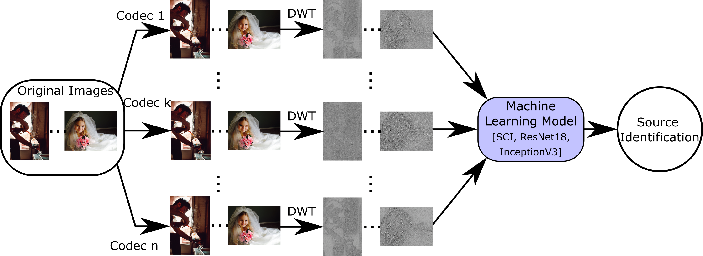

# Security and Forensics Exploration of Learning-based Image Coding

## Watermarking

TBC

## Source (DNN Architecture) Identification



#### Requirements

- [PyTorch](https://pytorch.org/)
- [Numpy](https://numpy.org/)
- [imageio](https://imageio.readthedocs.io/en/stable/)
- [scikit-learn](https://scikit-learn.org/stable/)
- [scikit-image](https://scikit-image.org/)
- [opencv-python](https://pypi.org/project/opencv-python/)
- [PyWavelets](https://pywavelets.readthedocs.io/en/latest/)

#### Dataset

[JPEG-AI Dataset](https://jpegai.github.io/3-datasets/) was used to train and evaluate the models.

#### Compress Images

[TensorFlow Compression (TFC)](https://github.com/tensorflow/compression) was used to compress images.

After compressing the dataset, its structure should be like this:

    dataset/
        -training_decoded/
            -COMPRESS_METHOD_1/
                -img/
                    -*.png
            -COMPRESS_METHOD_2/
                -img/
                    -*.png
            -...
        -validation_decoded/
            -COMPRESS_METHOD_1/
                -img/
                    -*.png
            -COMPRESS_METHOD_2/
                -img/
                    -*.png
            -...
        -test_decoded/
            -COMPRESS_METHOD_1/
                -img/
                    -*.png
            -COMPRESS_METHOD_2/
                -img/
                    -*.png
            -...

#### Usage

You can train/test a model using the following command:

```
python main.py --operation training/test \
               --dataset_path ROOT_PATH_TO_DATASET \
               --output_path PATH_TO_SAVE_OUTPUTS_MODELS \
               --network NETWORK_TO_USE \
               --model_path MODEL_TO_LOAD \
               --learning_rate 0.01 \
               --weight_decay 0.005 \
               --batch_size 128 \
               --epoch_num 50
```

### Citation

If you find this code useful, please consider citing:

    @inproceedings{bhowmik2021vcip,
        Author = {Deepayan Bhowmik and Mohamed Elawady and Keiller Nogueira},
        Title = {Security and Forensics Exploration of Learning-based Image Coding},
        Booktitle = {IEEE Visual Communications and Image Processing (VCIP)},
        Year = {2021}
    }

